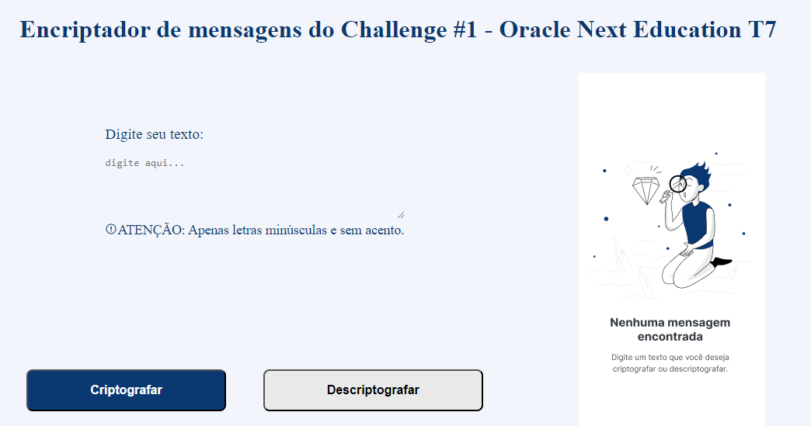

# Alura Challenge #1 | Decodificador de Textos

Repositório para armazenar o desafio final da formação "Iniciante em Programação T7 - ONE".

## 🛠 Funcionalidades
- `Criptografar:` O site recebe um texto digitado pelo usuário e criptografa-o, trocando cada vogal (a, e, i, o, u) por um conjunto de letras determinado. 
- `Descriptografar:` O site recebe um texto criptografado (precisa ter sido criptografado por este mesmo site) e descriptografa de volta para o texto digitado pelo usuário, trocando os conjuntos de letras de volta para as respectivas vogais determinadas. 

## 💻 Exemplo

## ✔ Tecnologias

